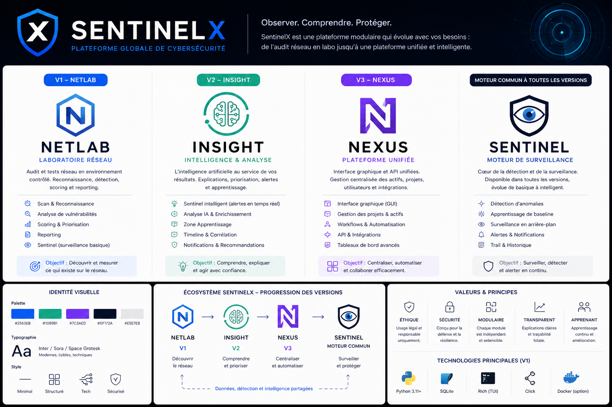

# SentinelX

**Observer. Comprendre. Protéger.**

SentinelX est une plateforme modulaire de cybersécurité qui évolue avec ses besoins : de l'audit réseau en labo jusqu'à une plateforme unifiée et intelligente.


---

## ⚠️ Cadre légal

SentinelX est conçu **exclusivement** pour des réseaux et systèmes que vous possédez, ou pour lesquels vous détenez une autorisation écrite explicite. Toute autre utilisation est illégale. Voir [`docs/sentinelx_steering_v1_1.md`](docs/sentinelx_steering_v1_1.md) pour le cadre complet.

---

## Vision

Comprendre comment une attaque fonctionne est le prérequis pour savoir s'en défendre. Chaque fonctionnalité offensive a son pendant défensif — commande d'attaque, technique de détection, méthode de remédiation. SentinelX est déterministe par conception : aucune IA ne décide qu'une vulnérabilité existe. La détection reste basée sur des règles ; l'IA n'arrive qu'en explication, jamais en détection.

## Écosystème — quatre produits, un moteur commun

| Version | Produit | Rôle | Statut |
|---|---|---|---|
| **V1** | **NetLab** — Laboratoire réseau | Audit et tests réseau en environnement contrôlé : reconnaissance, détection, scoring, reporting | 🔵 En développement |
| **V2** | **Insight** — Intelligence & analyse | L'IA au service des résultats : explications enrichies, priorisation, alertes, Zone Apprentissage | ⚪ Planifiée après V1 |
| **V3** | **Nexus** — Plateforme unifiée | Interface graphique et API unifiées, gestion centralisée, tableaux de bord | ⚪ Planifiée après V2 |
| — | **Sentinel** — Moteur de surveillance | Cœur de la détection, présent dans toutes les versions — de la surveillance basique à intelligente | 🔵 Basique en V1 |

*Premier un outil. Puis une intelligence. Puis une plateforme. Un jour, un SOC.*

## Le pipeline central

```
DISCOVER → DETECT → ASSESS → EXPLAIN → LEARN → REMEDIATE → VERIFY
```

| Étape | Rôle | Modules V1 principaux |
|---|---|---|
| DISCOVER | Identifier les actifs et services exposés | `device_fingerprint`, `dns_enum`, `passive_recon` |
| DETECT | Trouver les faiblesses et mauvaises configurations | `tcp_scan`, `udp_scan`, `smb_enum`, `misconfig_detection`, `default_creds` |
| ASSESS | Calculer le score de risque de chaque Finding | `risk_scorer` (formule inspirée CVSS, documentée) |
| EXPLAIN | Produire une explication en 3 angles | Base de connaissances locale (IA en V2 uniquement) |
| LEARN | Former l'utilisateur de façon interactive | Zone Apprentissage — V2 uniquement |
| REMEDIATE | Appliquer les corrections | Manuel en V1 / scripts automatisés en V2+ |
| VERIFY | Rescanner et confirmer le correctif | `netlab rescan --session <id>` |

## Statut actuel — V1 NetLab

Développement en cours, suivi par tickets (19 au total pour la V1).

- [x] `core/finding.py` — le contrat central : modèle `Finding` typé (enums, dataclasses)
- [x] `core/database.py` — persistance SQLite locale par session
- [ ] `core/dependencies.py` + `netlab doctor`
- [ ] `core/risk_scorer.py`
- [ ] `cli.py`
- [ ] Modules de reconnaissance et de détection
- [ ] Sentinel basique
- [ ] Génération de rapports (PDF/HTML/JSON)
- [ ] Nettoyage de labo

Détail complet des tickets et des règles d'architecture : [`docs/sentinelx_steering_v1_1.md`](docs/sentinelx_steering_v1_1.md).

## Stack technique (V1)

- **Langage** : Python 3.10+, cross-platform Windows + Linux
- **CLI** : [Typer](https://typer.tiangolo.com/)
- **Affichage terminal** : [Rich](https://github.com/Textualize/rich)
- **Persistance** : SQLite (stdlib), un fichier par session
- **Outils externes** : nmap, enum4linux — vérifiés par `netlab doctor` au démarrage

## Valeurs

- **Éthique** — usage légal et responsable uniquement
- **Sécurité** — conçu pour la défense et la résilience
- **Modulaire** — chaque module est indépendant et extensible
- **Transparent** — explications claires, traçabilité totale (aucun score sans formule visible)
- **Apprenant** — apprentissage continu et amélioration

## Installation

> 🚧 V1 en cours de construction — instructions d'installation à venir une fois le premier pipeline complet fonctionnel.

## Licence

MIT — voir [`LICENSE`](LICENSE).

## Auteur

Développé par [Gédéon](https://github.com/GedeonTch) — étudiant en cybersécurité et développement informatique.
